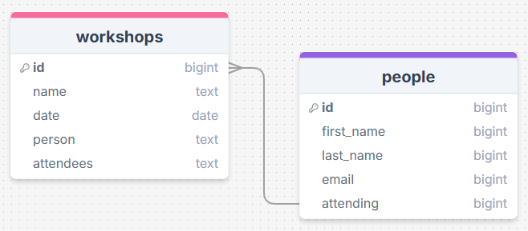
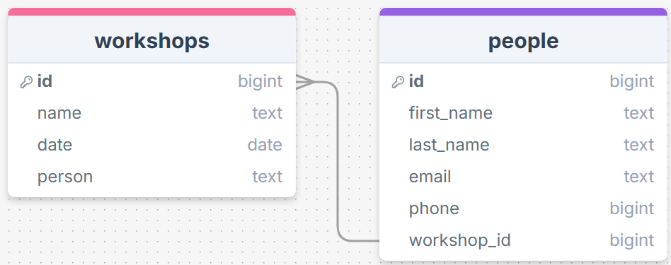
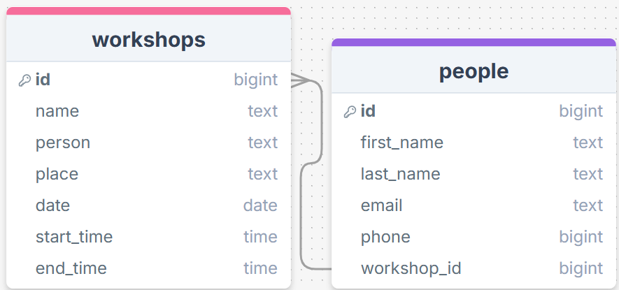
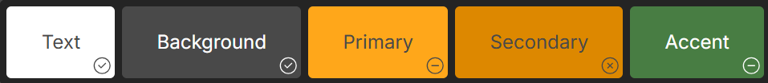
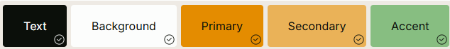

# Sprint 1 - A Working UI Prototype

## Sprint Goals

Develop a prototype that simulates the key functionality of the system, then test and refine it so that it can serve as the model for the next phase of development in Sprint 2.

[Figma](https://www.figma.com/) is used to develop the prototype.

---

## Initial Database Design

This is the initial design of my database. It includes two tables, one that takes care of the workshops, and one that takes care of the people, and the two are connected through a foreign key. The workshop table has the name of the workshop, the date, and person who is running it. It also includes a column that counts how many people are attending. The people table has columns that is the first and last name of the person, the email of the attendee, and a foreign key linked to which workshop they are attending.

## Second database design

I talked to my user, and they had a few thoughts on the initial database design.

> "I think that you should be able to see the persons phone number as well as their email."

So I made some changes based on their feedback, adding a phone number column to the people table:

## Final database design

I talked with my user again about the design of the database and they had some more thoughts.

> "There should be a start and end time that I can add to the workshop"

> "There should be a place so people know where it is"

So I implemented there ideas into a final design that includes columns for start-time, end-time and place of the workshop in the workshop table:

---

## UI 'Flow'

The first stage of prototyping was to explore how the UI might 'flow' between states, based on the required functionality.

This Figma demo shows the initial design for the UI 'flow':

<iframe style="border: 1px solid rgba(0, 0, 0, 0.1);" width="350" height="450" src=https://www.figma.com/proto/651HVDrM6SQ1mM6cJqOV0h/register-flow-v1?node-id=0-1&t=FQmPMMEXUKwYsxWB-1 allowfullscreen></iframe>

### Testing

I talked with my user about what they thought of my flow, and they came up with some new improvements. 
one thing they said was

 > “The register button should take you to a separate page with a form on it, the form shouldn’t be on the same page” 

They also said

 > “The 'see more' button should be on teh left of the text as it might be better as you read left to right” 

 

### Changes / Improvements

From this feedback, I improved the flow diagram to include these suggestions

 - I added the form onto a separate page

 - I updated the see more button to be on the left of the text.

<iframe style="border: 1px solid rgba(0, 0, 0, 0.1);" width="350" height="450" src=https://www.figma.com/proto/tBsYkE4qc6i5L7hpU1Zt97/register-flow-v2?node-id=0-1&t=FQmPMMEXUKwYsxWB-1 allowfullscreen></iframe>

---

## Initial UI Prototype

The next stage of prototyping was to develop the layout for each screen of the UI.

This Figma demo shows the initial layout design for the UI:

<iframe style="border: 1px solid rgba(0, 0, 0, 0.1);" width="350" height="450" src=https://www.figma.com/proto/BLT2CqOHnbI7Y3M45DoA0g/register-design-v1?t=ZPWO7OttAuVBCLD4-1 allowfullscreen></iframe>

### Testing

When I showed this to my user, they thought that the design needed some improvements.
Some things that they suggested were:

> “The title/image should be centered and the admin should be smaller.”

> “The home buttons should be on the top right” 

> “Register buttons should be centered” 

> “The home should be an icon instead of a word” 

### Changes / Improvements

I took this feedback that they gave me, and centered the title/header bar, and made the admin button smaller, I moved all the "Home" buttons, and moved them all to the top right corner of the screen and replaced the old rectangular button with a house Icon instead of the word "home". I also made all the register buttons in the center of the page, not just the one on the actual form page.

<iframe style="border: 1px solid rgba(0, 0, 0, 0.1);" width="350" height="450" src=https://www.figma.com/proto/CTx0x1GlQHbeAfUbJ0kK1f/register-design-v2?node-id=1-2&t=BYTbVz3aboOKwBF0-1 allowfullscreen></iframe>

---

## Refined UI Prototype

Having established the layout of the UI screens, the prototype was refined visually, in terms of colour, fonts, etc.

This Figma demo shows the UI with refinements applied, using the colour scheme below:

<iframe style="border: 1px solid rgba(0, 0, 0, 0.1);" width="350" height="450" src=https://www.figma.com/proto/QLhkgEYs9dDDCx5qcqgs12/register-design-v4?t=xWohseJpAdvAy6AY-1 allowfullscreen></iframe>

### Testing

I showed this design to my user, and they had a few comments about the design

> "I think that a light mode would be better because the colours in the dark mode don't look right."

### Changes / Improvements

I made a light mode option with different colors and black text, which is easier to see than the white text in dark mode using this colour scheme:

<iframe style="border: 1px solid rgba(0, 0, 0, 0.1);" width="350" height="450" src=https://www.figma.com/proto/rJnuf8gaOJ2Xx5Rfgu8cpP/register-design-v3?t=xWohseJpAdvAy6AY-1 allowfullscreen></iframe>

---

## Sprint Review

The sprint was an overall success, as it allowed me to form an idea of what the web app should look like and how it should feel to use. It moved the project forwards as it allowed me and my user to discuss and refine ideas such as layout, colour schemes and UX. A key success point was when the user and I found a colour scheme that looked appealing, but also fit the requirements of the website. Something that didn't go well was when I made the dark mode version of the website, and it was a bad combination of colours. However, this was an easy fix, as I easily made a light mode option with better colours that looked more appealing and smooth. Overall I think this sprint was a success, as I was able to easily communicate with my end user to work out a clear design for my Web App.
