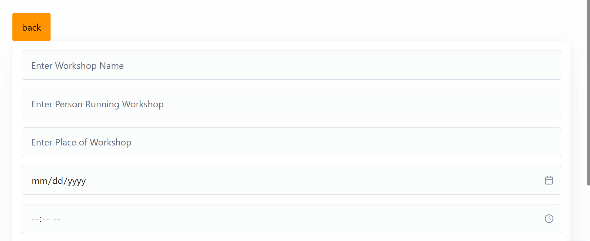
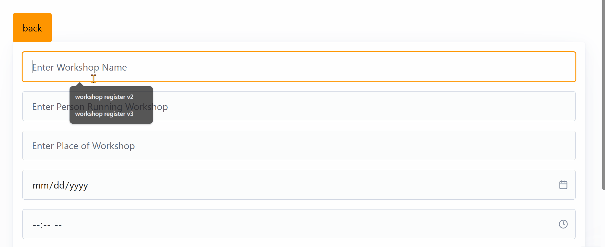
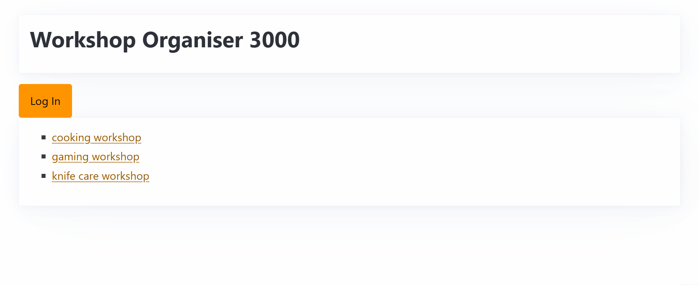

# Sprint 2 - A Minimum Viable Product (MVP)

## Sprint Goals

Develop a bare-bones, working web application that provides the key functionality of the system, then test and refine it so that it can serve as the basis for the final phase of development in Sprint 3.

---

## Implemented Database Schema

Replace this text with notes regarding the DB schema.

---

## Initial Implementation

The key functionality of the web app was implemented:

---

## Testing Workshop list on the main page

The list of available workshops for users to register for is a core part of the functionality of the web app. When my user and I tested the functionality of the list, I realized that the ones that had already been still showed up. To test this, we made an imaginary workshop and set the date to be in the past. When we went and checked the list on the home page, the workshop was still there.

### Changes / Improvements

 To fix the problem, I made sure to add a sort in the query for the home page that meant that it would only show the ones that were in the future.

---

## Testing Admin Login

The admin login is how the admin user logs in to the back-end of the website to see a list of the registrations, add and delete workshops and see past workshops. How I originally made the log-in was tedious as every time you left the back end, you needed to sign in again.

### Changes / Improvements

I added session data to allow the admin to stay logged in when they log in, and have to push a button to log out, and can access the back-end without having to log back in every time.

---

## Testing FEATURE NAME HERE

Replace this text with notes about what you are testing, how you tested it, and the outcome of the testing

**PLACE SCREENSHOTS AND/OR ANIMATED GIFS OF THE TESTING HERE**

### Changes / Improvements

Replace this text with notes any improvements you made as a result of the testing.

**PLACE SCREENSHOTS AND/OR ANIMATED GIFS OF THE IMPROVED SYSTEM HERE**

---

## Testing FEATURE NAME HERE

Replace this text with notes about what you are testing, how you tested it, and the outcome of the testing

**PLACE SCREENSHOTS AND/OR ANIMATED GIFS OF THE TESTING HERE**

### Changes / Improvements

Replace this text with notes any improvements you made as a result of the testing.

**PLACE SCREENSHOTS AND/OR ANIMATED GIFS OF THE IMPROVED SYSTEM HERE**

---

## Testing FEATURE NAME HERE

Replace this text with notes about what you are testing, how you tested it, and the outcome of the testing

**PLACE SCREENSHOTS AND/OR ANIMATED GIFS OF THE TESTING HERE**

### Changes / Improvements

Replace this text with notes any improvements you made as a result of the testing.

**PLACE SCREENSHOTS AND/OR ANIMATED GIFS OF THE IMPROVED SYSTEM HERE**

---

## Sprint Review

Replace this text with a statement about how the sprint has moved the project forward - key success point, any things that didn't go so well, etc.

