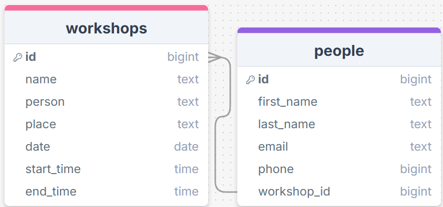
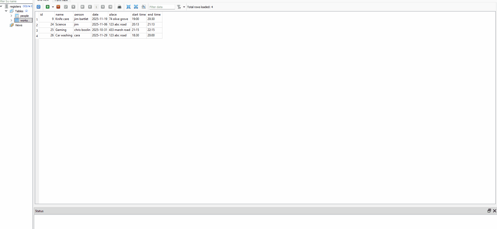

# Sprint 2 - A Minimum Viable Product (MVP)

## Sprint Goals

Develop a bare-bones, working web application that provides the key functionality of the system, then test and refine it so that it can serve as the basis for the final phase of development in Sprint 3.

---

## Implemented Database Schema

The database was implemented into the web app and used in many different ways, such as for the admin to see the records of who would be attending which workshops.

---

## Initial Implementation

The key functionality of the web app was implemented:

---

## Testing Workshop list on the main page

The list of available workshops for users to register for is a core part of the functionality of the web app. When my user and I tested the functionality of the list, I realized that the ones that had already happened still showed up. To test this, we made an imaginary workshop and set the date to be in the past. When we went and checked the list on the home page, the workshop was still there.

### Changes / Improvements

 To fix the problem, I made sure to add a sort in the query for the home page that meant that it would only show the ones that were in the future.

---

## Testing Admin Login

The admin login is how the admin user logs in to the back-end of the website to see a list of the registrations, add and delete workshops and see past workshops. How I originally made the log-in was tedious as every time you left the back end, you needed to sign in again. To test this, I logged in and left the admin page, and found that I didn't stay signed in.

### Changes / Improvements

I added session data to allow the admin to stay logged in when they log in, and have to push a button to log out, and can access the back-end without having to log back in every time.

---

## Testing Registering for a Workshop

The register form is a vital part of the web app as it is how anyone can sign up for the different workshops. When I tried to add a phone number, I realized that it was possible to write letters in the form, as I had forgot to make the field a "number" type, and it waws instead a "text" type. I tested this by trying all sorts of inputs, like both numbers and letters, and I found that it accepted letters and numbers.

### Changes / Improvements

To fix this, I changed the code in the register form to make sure that it was indeed a number field type, instead of a text type, and wouldn't accept letter inputs.

To make sure that the data base gets updated upon a user registering using the form, I did a test register for the Knife care workshop:

---

## Testing Adding Workshops

The adding workshop function is vital to the functionality of the workshop as it means that the admin can add workshops, and I tested it by trying to add a workshop and make sure that all the inputs work, and the workshop is added. While testing the form, It did not work, because I had updated the form and database, but I had not updated the processing of the form to add it to the database.

### Changes / Improvements

To fix the problem, I made sure to update the python processing code to make sure it matches the inputs and the database. 

---

## Testing Admin Data Records

The admin data records are an important part of the organizing process for the admin to make sure that they know all the records for the different workshops. 
I checked side by side with the database to make sure that the data matched. The data matched the data in the database.

Database Data: 

Website Data: 

---

## Testing Data shown on individual workshop pages

The data shown on the individual workshops pages is an important part of the UX as if the data is wrong or absent, the users would not have the correct information to attend the workshops that they want to. I checked the website data side by side with the database to make sure that the data matched. The data matched the data in the database.

Database Data: 

Website Data: 

---
## Sprint Review

Overall, This sprint has gone well. I has moved the project forward by making a fully functioning "prototype" for the web app to be based off and refined, and can handle the data with ease. One key success point was making the Admin login page work, as that allows for the admin to log-in and be able to easily check the data. Another major success point was making the users be able to register for the workshops, which is the main point of the web app.

