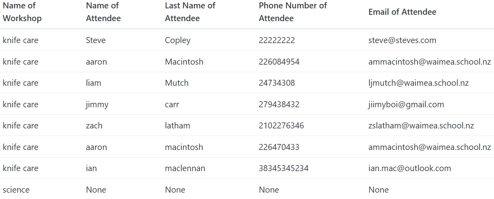
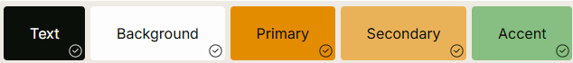

# Sprint 3 - A Refined and Complete System

## Sprint Goals

Develop the system until it is fully featured, with a refined UI and it satisfies the requirements. The system will be fully tested at this point.

---

## Final Implementation

The web app is fully implemented with a refined UI:

**PLACE SCREENSHOTS AND/OR ANIMATED GIFS OF THE SYSTEM HERE**

---

## Testing Admin Data Records

The admin data records are an important part of the organizing process for the admin to make sure that they know all the records for the different workshops. 
I checked side by side with the database to make sure that the data matched. The data matched, but I found the format of the data tricky to read.

### Changes / Improvements

In light of the data being hard to take in, I changed the layout of the admin page so instead of having one big list, it contains links to individual workshops, which in turn has a list of all the records of attendees, and shows the total number of people registered for the workshop. However, I thought that the admin may want to see all the records, so I also added a link that takes them to what was originally there, in the event that they need to know the data of all people at once.

One Final change I made is so that it shows a list of unregistered workshops down the bottom of the all workshop registers, so the admin user can see what workshops aren't currently registered for, which means they can know what ones need more advertising or what ones may not have anyone coming to them.

---

## Testing List of Workshops

The list of workshops is the list of all the available workshops for people to register for. I tested this feature by making sure that the names of the correct workshops were showing up, and only the workshops that had not been. Upon showing this to the user, we found that all the correct workshops were showing up, but the format of the list was not incredible, and could be improved.

### Changes / Improvements

From this testing, I came up with a design that is much more modern and looks more professional.

I showed this to my user and they had some feedback:
>"I think you should swap the styles and position of the name and the button, as you read left to right."
>"The workshop name and the link should be bold."
>"It should say 'details' instead of 'see more'."

---

## Testing Colour scheme

The colour scheme is one of the most important aspects of designing a useable website. Originally, I wasn't using a set colour scheme, so my website looked dull and boring, and my user thought an orange colour scheme should be added.

### Changes / Improvements

To have a more modern look, me and my user decided on the following colour scheme:

I also changed all the buttons to submit any form this green colour:

---

## Code Validation

This is a vital final step in making sure that the code of a website is valid, secure, and efficient. I tested my code on a validator, and these were the results:

CSS:

Home page:

It came up with a warning, however it is unimportant and I can ignore it.

New Workshop Form Page:

It came up with some errors. This means that the "Placeholder" values I have in three of the fields need to go, as they are not allowed in that input type. I fixed this problem by changing the code in the Jinja so the placeholders aren't there anymore. When I validated it after these changes, it looked like this:

---

## Sprint Review

Overall, this sprint was a major success. I managed to turn my MVP into a fully functional, stylized and modern web app for the end-user to use. One major success point was implementing the new admin records page, as that really improved the UI for the admin, as the previous layout was not good, and difficult for the admin to use. Another success point was implementing the new colour scheme. This is because it really moved the project forward in terms of UI, as it was previously just a plain, monochrome web app, which looks unprofessional and did not look good. However, the new colour scheme is modern and aesthetic, and improves the UI a lot. One thing that did not go so well was the implementation of the styles on the main page, as the end-user kept changing their mind on what looks good, so it didn't go as smoothly as I anticipated.

